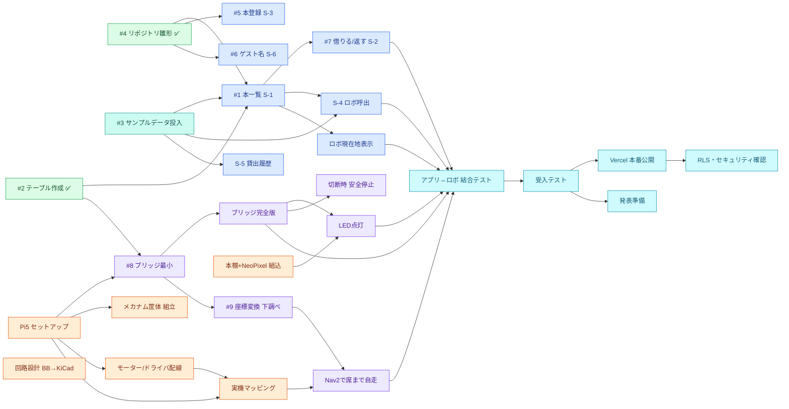
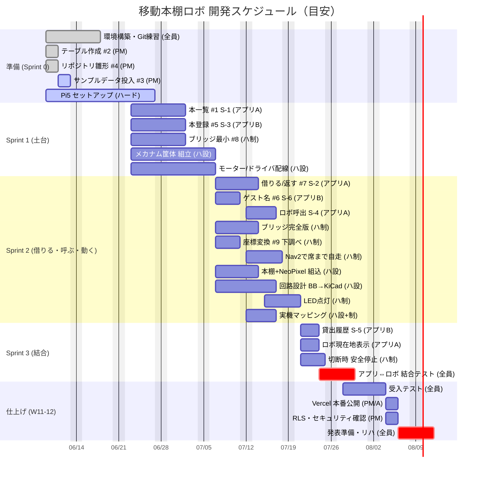

# 開発ロードマップ（全Issue・依存関係＆ガント）

> このページは **GitHub 上で開くと図が自動表示**されます（Mermaid 対応）。
> VS Code で図を見たい場合は拡張機能「Markdown Preview Mermaid Support」を入れてプレビューしてください。
> 各Issueの詳しい進め方は [開発の手引き](開発の手引き/index.html) を参照。番号は GitHub 実Issue番号（資料により旧番号の場合あり）。

---

## 1. 依存関係マップ（このIssueが終わらないと次に進めない）

矢印の元 → 先 が「先にやる → 次にできる」の関係です。✅ は完了済み。

**読み方の例**：`#1 本一覧` は `#2・#3・#4` が終わってから着手。`#7 借りる/返す` は `#1` の後。`結合テスト` はアプリ（#7・S-4・現在地）とロボ（ブリッジ完全版・Nav2自走・LED）が揃ってから。

---

## 2. ガントチャート（時間軸・2週間スプリント）

> **日付は目安**です。実際の開講週に合わせて編集してください（`done`=完了, `active`=進行中, `crit`=重要マイルストン）。

---

## 3. 担当 × スプリント 早見表

| Issue | 画面/要件 | 担当 | スプリント | 前提（先にやる） |
|:--|:--|:--:|:--:|:--|
| #1 本一覧 | S-1 / F-02 | アプリA | S1 | #2,#3,#4 |
| #5 本登録 | S-3 / F-01 | アプリB | S1 | #2,#3,#4 |
| #8 ブリッジ最小 | F-09 | ハ制 | S1 | #2, Pi5 |
| #6 ゲスト名 | S-6 / F-04 | アプリB | S2 | #4 |
| #7 借りる/返す | S-2 / F-05,06 | アプリA | S2 | #1 |
| S-4 ロボ呼出 | S-4 / F-08,09 | アプリA | S2 | #1, #3 |
| ブリッジ完全版 | F-09 | ハ制 | S2 | #8 |
| #9 座標変換 | F-08 | ハ制 | S2 | #8 |
| Nav2自走 | F-08 | ハ制 | S2 | #9, 実機マッピング |
| LED点灯 | F-10 | ハ制 | S2 | ブリッジ完全版, 本棚+NeoPixel |
| メカナム筐体 | ― | ハ設 | S1〜2 | Pi5 |
| モーター/ドライバ | ― | ハ設 | S1〜2 | Pi5 |
| 本棚+NeoPixel | F-10 | ハ設 | S2 | 筐体 |
| 回路設計 BB→KiCad | ― | ハ設 | S2 | モーター・部品確定 |
| 実機マッピング | F-08 | ハ設+制 | S2 | Pi5, 走行 |
| S-5 履歴 | S-5 / F-07 | アプリB | S3 | #3 |
| ロボ現在地表示 | (D2) | アプリA | S3 | #1 |
| 切断時 安全停止 | (D5) | ハ制 | S3 | ブリッジ完全版 |
| 結合テスト | ― | 全員 | S3 | アプリ＋ロボ各種 |
| 受入テスト | ― | 全員 | W11 | 結合テスト |
| Vercel公開 | ― | PM/A | W12 | 受入テスト |
| RLS・セキュリティ確認 | ― | PM | W12 | Vercel公開 |
| 発表準備 | ― | 全員 | W12 | 受入テスト |

> MVP最優先ライン：#1・#5・#7・S-4・現在地表示／#8・ブリッジ完全版・Nav2自走・LED／Pi5・筐体・本棚+LED・マッピング／結合テスト。#6・S-5・COULD は動いてから。
